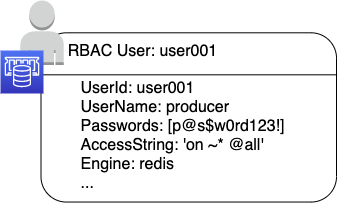
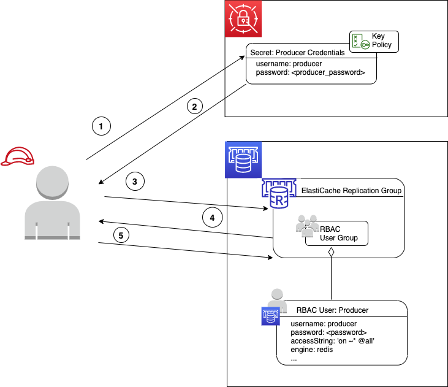
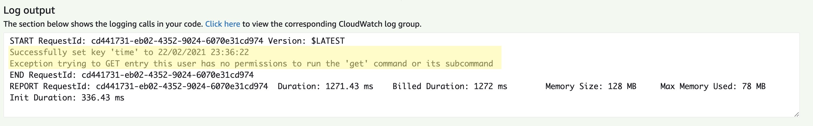
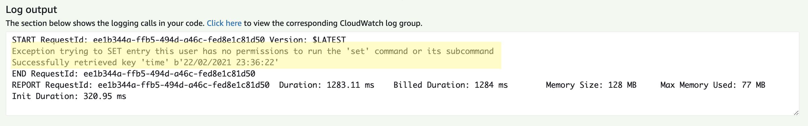

# AWS ElastiCache support for Redis Role Based Access Control (RBAC)

With Amazon ElastiCache for Redis 6, you can control cluster access via a feature called Role-Based Access Control (RBAC).  Through RBAC, you can define Access Control Lists (ACLs) that model access patterns – allowing you to better define who can access a Redis cluster and what commands and keys they can access.

When configured for RBAC, ElastiCache Redis replication groups will authenticate RBAC users based on the username and password provided when connections are established, and Redis commands and key access are authorized by the access strings (defined in Redis ACL syntax) for each RBAC user.



Redis RBAC users and ACLs, however, are not linked to AWS Identity Access Management (IAM) roles, groups or users; the dissociation between AWS IAM and Redis RBAC means that there is no out-of-the-box way to grant IAM entities (roles, users or groups) read and write access to Redis.

In this blog, we will present a solution that will allow you to associate IAM entities with ElastiCache RBAC users and ACLs. The overall solution will demonstrate how RBAC users can effectively be associated with IAM through the user of AWS Secrets Manager as a proxy for granting access to RBAC user credentials.

*	A set of Redis RBAC users will be defined; each with usernames, passwords and ACL access strings – this will define the commands and keys that a user has access to.

*	IAM entities (roles, users, groups) will be granted access to RBAC user credentials (username and password) stored in AWS Secrets Manager through secret policies and IAM policies.

*	Users, applications and services that have roles or users that can access RBAC user credentials from Secrets Manager can then use them to connect to ElasticacheRedis by assuming an RBAC user – which will also define which commands and keys they have access to.

## Design: Managing ElastiCache Redis access with RBAC, AWS SecretsManager and AWS IAM

### Storing Redis RBAC passwords in SecretsManager

When RBAC users are created (either via AWS CLI, AWS API or AWS Cloudformation), they are specified with a plaintext password and a username.  These usernames and passwords must be shared with the actors who will access the Redis replication group via RBAC users (human users or applications).

The solution that we will present will leverage Secrets Manager to generate a password that will be used when the RBAC user is created meaning that no plaintext passwords exposed and must be retrieved through Secrets Manager.

### Managing access to RBAC passwords in SecretsManager with IAM

Access to secrets in SecretsManager can be restricted to specific IAM entity – these entities can then retrieve the username and password by making the appropriate AWS API or CLI call.

### Tying it together: Managing access to Redis with RBAC, SecretsManager and IAM

The combination of IAM policies of an IAM entity and the policies associated with the secret will determine which entities will be able to access the secret – and the RBAC username and password stored within; effectively linking an IAM entity with an RBAC user.



The above diagram demonstrates the flow of the solution. First, an actor with an IAM role that has permissions to the “Producer Credentials” secret reads the secret from AWS Secrets manager (1, 2); the actor then establishes a connection with the Producer credentials to an ElastiCache replication group that is configured with an RBAC user group that has the Producer RBAC User in it (3).  Once authenticated (4), the user can perform commands and access keys (5), however the commands and keys that can be accessed are dictated by the access string on the Producer RBAC user.

## Implementation in AWS Cloud Development Kit (CDK)

We present the solution to you in AWS Cloud Development Kit (CDK), which is a software development framework that defines infrastructure through object-oriented programming languages -- in our case, Typescript.

The following will be deployed:
* One VPC with isolated subnets, one AWS Secrets Manager VPC endpoint
* One security group with an ingress rule that allows all traffic in via port 6379
* Three ElasticaCache RBAC users: default, consumer, producer
* Three secrets: default, producer, consumer
* One ElastiCache RBAC user group
* One ElastiCache subnet group
* One ElastiCache replication group
* Three IAM roles: consumer, producer, outsider
* One Lambda layer which contains the redis-py Python module
* Three Lambda functions: producerFn, consumerFn, outsiderFn


A VPC is created for the purpose of hosting the ElastiCache replication group and the Lambda functions that will be used to demonstrate how to access ElastiCache.  The code snippet defines the VPC with an isolated subnet, which in CDK terms, is a private subnet with no routing to the Internet.  In order for resources in the isolated subnet to access Secrets Manager, a Secrets Manager VPC Interface Endpoint is added.


```
const vpc = new ec2.Vpc(this, "Vpc", {
      subnetConfiguration: [
        {
          cidrMask: 24,
          name: 'Isolated',
          subnetType: ec2.SubnetType.PRIVATE_ISOLATED,
        }
      ]
    });

    const secretsManagerEndpoint = vpc.addInterfaceEndpoint('SecretsManagerEndpoint', {
      service: ec2.InterfaceVpcEndpointAwsService.SECRETS_MANAGER,
      subnets: {
        subnetType: ec2.SubnetType.PRIVATE_ISOLATED
      }
    });

secretsManagerEndpoint.connections.allowDefaultPortFromAnyIpv4();

```

To modularize the design of the solution, a RedisRbacUser class is also created.  This class is composed of two CDK resources: a Secrets Manager Secret and an ElastiCache CfnUser; these resources are explicitly grouped together since the Secret stores the CfnUser password, and as will be shown later, read and decrypt permissions to the Secret will be granted to an IAM user.

A note about unsafeUnwrap(); this method was added to the Secrets Manager library in CDK version 2 and is used in place of toString() to explicitly force the developer to understand the consequences of decoded secrets in code. For details, please see the documentation for [unsafeUnwrap()](https://docs.aws.amazon.com/cdk/api/v2/docs/aws-cdk-lib.SecretValue.html#unsafewbrunwrap) in the CDK API documentation.

```
export class RedisRbacUser extends cdk.Construct {
  ...

  constructor(scope: cdk.Construct, id: string, props: RedisRbacUserProps) {
    super(scope, id);

    ...

    this.rbacUserSecret = new secretsmanager.Secret(this, 'secret', {
      generateSecretString: {
        secretStringTemplate: JSON.stringify({ username: props.redisUserName }),
        generateStringKey: 'password',
        excludeCharacters: '@%*()_+=`~{}|[]\\:";\'?,./'
      },
    });

    const user = new elasticache.CfnUser(this, 'redisuser', {
      engine: 'redis',
      userName: props.redisUserName,
      accessString: props.accessString? props.accessString : "off +get ~keys*",
      userId: props.redisUserId,
      passwords: [this.rbacUserSecret.secretValueFromJson('password').unsafeUnwrap()]
    })

    ...

  }

}
```

The RedisRbacUser class is instantiated in the following code snippet, with an example of the Redis ACL syntax used in the accessString.

```
  const producerRbacUser = new RedisRbacUser(this, producerName+'RBAC', {
      redisUserName: producerName,
      redisUserId: producerName,
      accessString: 'on ~* -@all +SET'
    });
```

An IAM role is granted the ability to read the RedisRbacUser’s secret (the username and password). This association means that the IAM role can decrypt the username and password and use them to establish a connection with Redis as the producerRbacUser.

```
  const producerRole = new iam.Role(this, producerName+'Role', {
      ...
    });

    producerRbacUser.grantSecretRead(producerRole)
```

The function grantSecretRead in the RedisRbacUser class modifies the role that is passed into it to allow it to perform actions “secretsmanager:GetSecretValue” and “secretsmanager:DescribeSecret”.  The same function also modifies the secret by adding a resource policy that allows the same actions and adds the provided role to the principal list – this prevents unlisted principals from attempting to access the secret once the stack is deployed.

```
  public grantReadSecret(principal: iam.IPrincipal){
    if (this.secretResourcePolicyStatement == null) {
      this.secretResourcePolicyStatement = new iam.PolicyStatement({
        effect: iam.Effect.ALLOW,
        actions: ['secretsmanager:DescribeSecret', 'secretsmanager:GetSecretValue'],
        resources: [this.rbacUserSecret.secretArn],
        principals: [principal]
      })

      this.rbacUserSecret.addToResourcePolicy(this.secretResourcePolicyStatement)

    } else {
      this.secretResourcePolicyStatement.addPrincipals(principal)
    }

    this.rbacUserSecret.grantRead(principal)
  }
```

A Lambda function then uses the IAM role created previously, so that it can decrypt the username and password Secret and access the ElastiCache for Redis replication group.

```
    const producerLambda = new lambda.Function(this, producerName+'Fn', {
      ...
      role: producerRole,
      ...
      environment: {
        redis_endpoint: ecClusterReplicationGroup.attrPrimaryEndPointAddress,
        redis_port: ecClusterReplicationGroup.attrPrimaryEndPointPort,
        secret_arn: producerRbacUser.getSecret().secretArn,
      }
    });
```

## Deploying the solution

The infrastructure for this solution is implemented in AWS Cloud Development Kit (CDK) in Typescript and can be cloned from this GitHub repository.

You can setup your environment for CDK by following the AWS Cloud Development Kit Getting Started document here: https://docs.aws.amazon.com/cdk/latest/guide/getting_started.html#getting_started_prerequisites

To deploy the solution, you’ll first want to build the lambda zip files that will be used in the Lambda functions; to do so, navigate to the root of the project on your machine and enter the following command in your terminal:

``` $ npm run-script zip ```

To deploy the solution to your account, run the following command from the root of the project:

``` $ cdk deploy ```

The command will attempt to deploy the solution in the default AWS profile defined in either your `~/.aws/config` file or your `~/.aws/credentials` file.  You can also define a profile by specifying the `--profile profile_name` at the end of the command.

## Testing the solution

Three Lambda functions were deployed as a part of the stack: a Producer, a Consumer and an Outsider function.

### Creating a Test JSON for each function

To test each function, you’ll need to create a test event for each.  To create a test object, click the ‘Test’ button in the Lambda console and use the default JSON object in the body – the test functions will not read the event contents.


You can trigger each test by clicking on the test button


### Producer Function Reads and Writes to Redis

This function demonstrates how an IAM role, attached to a Lambda function can be used to retrieve a username and password from Secrets Manager, then use these credentials to establish a connection to Redis and peform a write operation.

The Producer function will write a key “time” with a value of the current time.



The Producer function will be able to write to Redis, and that is because it’s IAM role allows it to get and decrypt the ‘Producer’ username and password in Secrets Manager and its RBAC user was created with an Redis ACL Access String that allows all SET commands to be performed

### Consumer Function Can Read but Cannot Write to Redis

This function demonstrates the use case where you can allow a specific IAM role to access a Redis RBAC username and password from Secrets Manager and establish a connection with Redis, but the actions it can perform are restricted by an access string setting.

The Consumer function will attempt to write a key “time” with a value of the current time; it will subsequently attempt to read back the key “time”.



The Consumer function will not be able to write to Redis, but it will be able to read from it.  Even though the function has an IAM role that permits it to get and decrypt the ‘Consumer’ username and password in Secrets Manager, the ‘Consumer’ RBAC user was created with a Redis ACL Access String value that only allows the ‘GET’ command.


### Outsider Function Cannot Read and Cannot Write to Redis

This function demonstrates the use case where you can specify an IAM role that cannot access Redis because it cannot decrypt a username and password stored in Secrets Manager.

The Outsider Lambda function will attempt to get and decrypt the ‘Producer’ username and password from Secrets Manager, then read and write to the Redis cluster.


An exception is raised that indicates that it is not permitted to access the ‘Producer’ secret and that is because the IAM role attached to it does not have the permissions to decrypt the ‘Producer’ secret.

## Cost of Running the Solution

The solution to associate an IAM entity with an ElastiCache RBAC user required the deployment of a sample ElastiCache cluster, storing secrets in AWS Secrets Manager and defining an RBAC user and an RBAC user group.

* Secrets Manager:
  * $0.40 per secret per month, prorated for secrets stored less than a month
  * $0.05 per 10000 API calls
  * Assuming each of the three secrets are called 10 times for testing purposes in one day, the total cost would be (3 * $0.40 / 30) + (3 * 10 / 1000) * $0.05 = $0.04015

* ElastiCache:
  * cache.m4.large node $0.156 per hour
  * Assuming that the node used for one day the total cost would be $3.744

* Lambda Function:
  * $0.0000000021 per ms of execution time
  * Assuming that each lambda is called 10 times for testing purposes in one day and that the average execution time is 400ms, the total cost would be 3 * 400 * $0.000000021 = $0.00000252

The total cost of the solution, for 24 hours, assuming that each of the three Lambda functions are called 10 times would be $3.78415252.

## Cleanup and Teardown

To delete all resources from your account, including the VPC, you will need to call the following command from the project root folder:

`$ cdk destroy`


As in the cdk deploy command, the destroy command will attempt to execute on the default profile defined in ~/.aws/config or ~/.aws/credentials.  You can specify another profile by providing --profile as a command line option.

## Conclusion

While fine-grained access is now possible with the inclusion of Redis Role Based Access Control (RBAC) users, user groups and access strings in Amazon ElastiCache, there is no out-of-the box ability to associate RBAC users with IAM entities (roles, users and groups). This blog post presented a solution that restricted RBAC credentials (userame and password) access by storing them in AWS Secrets Manager and granting select IAM entities permissions to decrypt these credentials – effectively linking RBAC users with IAM roles.

### Additional benefits presented in this solution include:

* RBAC passwords are not defined, stored or shared in plaintext when RBAC users are created
* RBAC users and groups can be defined wholly in CDK (and by extension CloudFormation) and included as infrastructure-as-code
* You can trace Redis access to IAM users since RBAC usernames and passwords are stored and accessed through AWS Secrets Manager and access to these credentials can be traced via CloudTrail


### Additional Resources

* Amazon ElastiCache for Redis adds support for Redis 6 with managed Role-Based Access Control (RBAC)
https://aws.amazon.com/about-aws/whats-new/2020/10/amazon-elasticache-redis-support-managed-role-based-access-control/

* Authenticating Users with Role-Based Access Control (RBAC) https://docs.aws.amazon.com/AmazonElastiCache/latest/red-ug/Clusters.RBAC.html

* Granting read access to one secret
https://docs.aws.amazon.com/secretsmanager/latest/userguide/permissions_grant-get-secret-value-to-one-secret.html

* Redis ACL
https://redis.io/topics/acl
